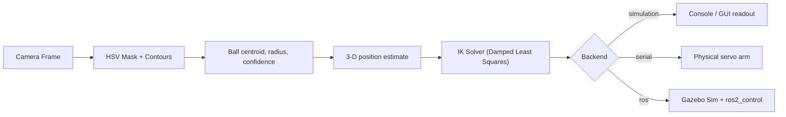

# 🔴🟢 Ball Detection + 6-DOF Robotic Arm

**Computer Vision + Robotics mini-project** — detect a red or green ball with a webcam, estimate its 3-D position, and drive a 6-DOF robotic arm to reach for it in real time.

[](https://github.com/YOUR_USERNAME/ball-arm-project/actions/workflows/ci.yml)


---

## Overview

This project is a complete perception-to-actuation pipeline:

1. **Detect** red/green balls in a video stream using HSV color filtering + contour analysis
2. **Localize** each ball in 3-D (X, Y, Z in cm) with a pinhole-camera distance model
3. **Solve inverse kinematics** for a 6-DOF arm using a damped-least-squares Jacobian method
4. **Drive the arm** — in software simulation, over serial to real hardware, or via ROS2/Gazebo
5. **Visualize** everything live in a tkinter control panel + OpenCV overlay

No hardware or ROS installation is required to try it — `python main_app.py` runs entirely in simulation.



---

## Demo

| Live detection + arm HUD | 3-D arm simulation |
|---|---|
| Ball is detected, annotated with distance/confidence, and the arm's live joint angles are overlaid on the video feed. | A matplotlib window shows the arm's pose and the tracked target in 3-D. |

*(Run `python main_app.py --allow-mock` to see this without a camera.)*

---

## Repository Structure

```
.
├── ball_detector.py        # HSV detection, distance estimation, annotation
├── ik_solver.py             # 6-DOF IK (damped-least-squares Jacobian + DH params)
├── arm_controller.py        # IK -> serial / ROS2 / simulation output bridge
├── main_app.py               # Main GUI application (tkinter + OpenCV)
├── calibrate.py              # Standalone HSV / focal-length calibration tool
├── ball_detector_node.py    # ROS2 node wrapper for detection + control
├── arm_6dof.urdf              # 6-DOF arm model for Gazebo Sim + ros2_control
├── config/
│   └── arm_controllers.yaml  # ros2_control controller manager config
├── launch_sim.py              # ROS2 launch file (Gazebo Sim + controllers)
├── demo_sim.py                 # Scripted demo: fake detections -> IK -> console
├── visualize_arm.py            # Static 3-D plot of the arm reaching a target
├── view_camera.py               # Minimal webcam viewer / index finder
├── test_standalone.py            # Full test suite — no ROS/hardware needed
├── arm_config.yaml                # DH params, joint limits, camera calibration
├── requirements.txt
├── requirements-dev.txt             # Headless OpenCV for CI/no-display environments
├── LICENSE                            # MIT
├── .gitignore
└── .github/workflows/ci.yml        # Runs test_standalone.py on every push
```

---

## Quick Start

### 1. Install

```bash
git clone https://github.com/YOUR_USERNAME/ball-arm-project.git
cd ball-arm-project
python3 -m venv .venv && source .venv/bin/activate     # optional but recommended
pip install -r requirements.txt
```

System packages (Ubuntu/WSL2), only needed if `tkinter` or OpenGL are missing:

```bash
sudo apt update
sudo apt install python3-tk libgl1-mesa-glx -y
```

### 2. Run the no-hardware, no-camera smoke test

```bash
python test_standalone.py
```

This exercises detection on a synthetic frame, an IK round-trip, and a full simulated pick sequence — useful for CI or a quick sanity check on any machine.

### 3. Run the live app

```bash
python main_app.py                    # webcam + GUI, simulation backend
python main_app.py --allow-mock        # no camera? use a synthetic moving ball
python main_app.py --color red         # detect red only
python main_app.py --calibrate         # open the HSV trackbar tool first
```

**Keyboard shortcuts** (video window focused):

| Key | Action |
|---|---|
| `q` | Quit |
| `r` / `g` / `b` | Detect red / green / both |
| `a` | Toggle arm movement on/off |
| `h` | Send arm to home position |

### 4. Calibrate for your own ball / lighting

```bash
python calibrate.py --color red --slot range1     # tune the main red HSV range
python calibrate.py --color red --slot range2     # tune red's hue-wraparound range
python calibrate.py --color green
python calibrate.py --focal-length --distance-cm 30 --diameter-cm 6.5
```

Press `s` to write the tuned values straight into `arm_config.yaml`.

### 5. Run with ROS2 + Gazebo Sim (optional)

```bash
# Install ROS2 Jazzy first: https://docs.ros.org/en/jazzy/Installation/Ubuntu-Install-Debians.html
sudo apt install ros-jazzy-ros-gz ros-jazzy-gz-ros2-control ros-jazzy-robot-state-publisher
pip install rclpy

source /opt/ros/jazzy/setup.bash
python3 launch_sim.py                                 # terminal 1: Gazebo + robot
python3 main_app.py --backend ros --arm-enabled        # terminal 2: control app
```

`arm_6dof.urdf` matches the DH parameters in `arm_config.yaml` and includes a fixed overhead camera sensor, so the simulated Gazebo camera feeds straight into the same detection pipeline used with a real webcam.

### 6. Run on real hardware

```bash
python main_app.py --backend serial --arm-enabled
```

Sends `J1:angle J2:angle ... J6:angle\n` over serial (`/dev/ttyUSB0` @ 115200 baud by default — edit `arm_config.yaml`). If the serial port can't be opened, it automatically falls back to simulation mode.

---

## How It Works

### Ball detection pipeline

```
BGR frame -> HSV conversion -> color mask (dual range for red)
   -> morphological open/close -> contour detection
   -> filter by area + circularity -> minEnclosingCircle
   -> distance = focal_length x real_radius / radius_px
   -> 3-D coords via pinhole camera model
```

Red requires **two HSV ranges** because hue wraps around 0°/180° in OpenCV — red sits at both ends of the hue circle.

| Color | H range | S range | V range |
|---|---|---|---|
| Red | 0–10 **and** 170–180 | 120–255 | 70–255 |
| Green | 40–85 | 70–255 | 70–255 |

### Distance estimation

```
distance_cm = focal_length_px * (ball_diameter_cm / 2) / radius_px
```

Calibrate `focal_length_px` once with `python calibrate.py --focal-length`.

### Inverse kinematics — damped least squares (Levenberg–Marquardt)

- Numerical Jacobian via central differences
- Error vector: `[dx, dy, dz, dwx, dwy, dwz]` (position-only mode drops the last 3)
- Update: `dq = J^T (J J^T + lambda^2 I)^-1 e`
- Joint limits clamped every iteration; raises `ArmError` after 200 non-converging iterations or on an out-of-workspace target

### DH parameters (default — replace with your arm's real measurements)

| Joint | d (cm) | a (cm) | alpha (rad) |
|---|---|---|---|
| 1 Base | 15 | 0 | pi/2 |
| 2 Shoulder | 0 | 14 | 0 |
| 3 Elbow | 0 | 14 | 0 |
| 4 Wrist roll | 0 | 0 | pi/2 |
| 5 Wrist pitch | 12 | 0 | -pi/2 |
| 6 End-effector | 6 | 0 | 0 |

Edit these in `arm_config.yaml`; `arm_6dof.urdf` mirrors the same geometry (in metres) for the Gazebo simulation.

---

## Error Handling

| Situation | Behavior |
|---|---|
| No ball detected | Arm stays still; status shows "Scanning..." |
| Low confidence (< 40%) | Detection skipped, arm not moved |
| Target out of workspace | `ArmError` raised, logged, arm holds position |
| Serial port unavailable | Falls back to simulation mode automatically |
| ROS/rclpy not installed | Falls back to simulation mode automatically |
| IK non-convergence | `ArmError` after 200 iterations, logged |
| Camera disconnected | Warning logged, automatic reconnect attempts |

---

## Troubleshooting

| Symptom | Fix |
|---|---|
| `tkinter not available` warning | `sudo apt install python3-tk` — the app still runs headlessly without it, just without the control panel. |
| WSL2: camera won't open | WSL doesn't pass USB devices through by default. Either run `main_app.py` from Windows PowerShell, or attach the webcam with [`usbipd-win`](https://learn.microsoft.com/en-us/windows/wsl/connect-usb). `--allow-mock` lets you keep developing without it. |
| No `DISPLAY` set (headless Linux/CI/container) | The app auto-detects this and runs in headless/console mode; `test_standalone.py` never needs a display at all. |
| Crash/segfault while opening the camera on a machine with no webcam or video driver at all | This happens in OpenCV's native video backend, before Python code can catch it. Skip camera probing entirely and use `python main_app.py --allow-mock`, or `python demo_sim.py` / `python test_standalone.py`, none of which touch `cv2.VideoCapture`. |
| `pip install opencv-python` fails to import (`libGL.so.1` missing) | `sudo apt install libgl1-mesa-glx`, or install `opencv-python-headless` instead (see `requirements-dev.txt`) if you don't need any GUI windows. |

---

## Testing

```bash
python test_standalone.py
```

Runs 4 self-contained checks with no camera or ROS required — detection on a synthetic frame, an IK forward/inverse round-trip accuracy check, simulated arm control (including confidence-based rejection), and a full detect→IK→controller integration pass. CI (`.github/workflows/ci.yml`) runs this on every push across Python 3.10–3.12.

---

## FAQ / Viva Reference

**Why HSV instead of BGR/RGB for color detection?**
HSV separates hue (color type) from saturation and value (lighting/brightness). A red ball under dim light still has roughly the same hue, just a lower V — this makes detection far more robust to lighting changes than thresholding raw RGB.

**Why does red need two masks?**
OpenCV represents hue as 0–180°. Red sits at 0° *and* wraps around to ~170–180°. A single contiguous range would only catch half of the red spectrum.

**What is circularity, and why threshold on it?**
`circularity = 4*pi*area / perimeter^2`. A perfect circle scores 1.0. Thresholding low (0.10 by default) rejects thin lines/noise while still tolerating non-circular objects.

**What is the Jacobian doing in IK?**
It maps joint velocities to end-effector velocity: `J * dq = dx`. Inverting it (via damped pseudo-inverse) gives the joint update needed to reduce the position error each iteration.

**What is Levenberg–Marquardt damping for?**
Near singularities the Jacobian becomes ill-conditioned and a plain pseudo-inverse produces huge, unsafe joint jumps. Adding `lambda^2 I` before inverting regularizes the solution, trading a little accuracy for stability.

**What's the novelty here versus a basic template?**
Multi-ball detection with confidence scoring, full 3-D localization (not just a 2-D centroid), full 6-DOF IK with proper DH parameterization and joint limits, three interchangeable output backends (simulation / serial / ROS2+Gazebo) with automatic fallback, a live tkinter + OpenCV GUI, an HSV/focal-length calibration tool, and a Gazebo-ready URDF with a matching ros2_control configuration.

---

## Roadmap / Ideas for Contributors

- [ ] Kalman-filter based ball tracking across frames (currently per-frame only)
- [ ] Analytical (closed-form) IK for the decoupled wrist, with numerical fallback
- [ ] Multi-camera triangulation for more accurate depth than the single-camera pinhole estimate
- [ ] Unit tests for `arm_controller.camera_to_arm_frame` edge cases

Contributions welcome — open an issue or a PR.

---

## License

Released under the [MIT License](LICENSE).
